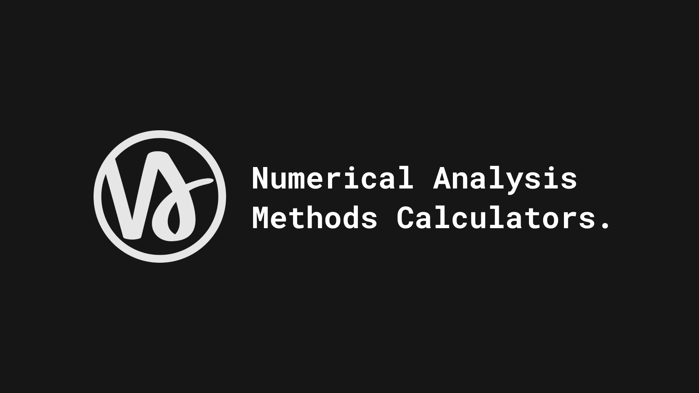

<p align="center">
  
</p>

<h1 align="center">Numerical Analysis Mini Project</h1>

<p align="center">
  A clean Next.js calculator for exploring root-finding algorithms and linear algebra methods with iteration tables, saved examples, history, and graph output.
</p>

<p align="center">
  
</p>

## Overview

Numerical Methods Calculator is a course-style numerical analysis workspace built with Next.js, React, Sass, and Math.js. It helps students test equations, compare method behavior, inspect every iteration, and solve small linear systems from one focused interface.

The app is designed around a minimal math-notebook feel: simple controls, method pages, calculation tables, matrix inputs, graph previews, saved examples, and a history flow for revisiting previous work.

## Methods Included

### Chapter 1: Root Finding

- Bisection Method
- False Position Method
- Simple Fixed Point Iteration
- Newton-Raphson Method
- Secant Method

### Chapter 2: Linear Systems

- Gauss Elimination
- LU Decomposition
- Gauss-Jordan Method
- Cramer's Rule

## Features

- Function parsing powered by `mathjs`
- Iteration tables for numerical root methods
- Matrix input workflow for systems of equations
- Graph output for supported root-finding methods
- Saved examples and calculation history
- Light and dark theme support
- Static export support for GitHub Pages
- Python reference implementations included beside the web app

## Tech Stack

- Next.js 14
- React 18
- Sass modules
- Math.js
- next-themes
- React Toastify

## Getting Started

Install dependencies:

```bash
npm install
```

Run the development server:

```bash
npm run dev
```

Open the app at:

```text
http://localhost:3000
```

Build for production:

```bash
npm run build
```

Build for GitHub Pages:

```bash
npm run build:pages
```

## Project Structure

```text
pages/              Next.js routes and method screens
pages/api/          Calculation API bridge
components/         Shared UI and method result components
context/            App state for examples, saved values, and history
utils/              Numerical method implementations and math helpers
styles/             Global Sass, modules, themes, and layout styles
public/             App icons, cover image, manifest, and static assets
assets/             Source image and SVG icon assets
*.py                Python reference implementations for the methods
```

## App Identity

<p align="center">
  
</p>

This project started as a numerical analysis mini project and grew into a small interactive learning tool. The focus is not only getting an answer, but seeing the path the method takes to reach it.

## Author

Built by `mohamedessam18`.
